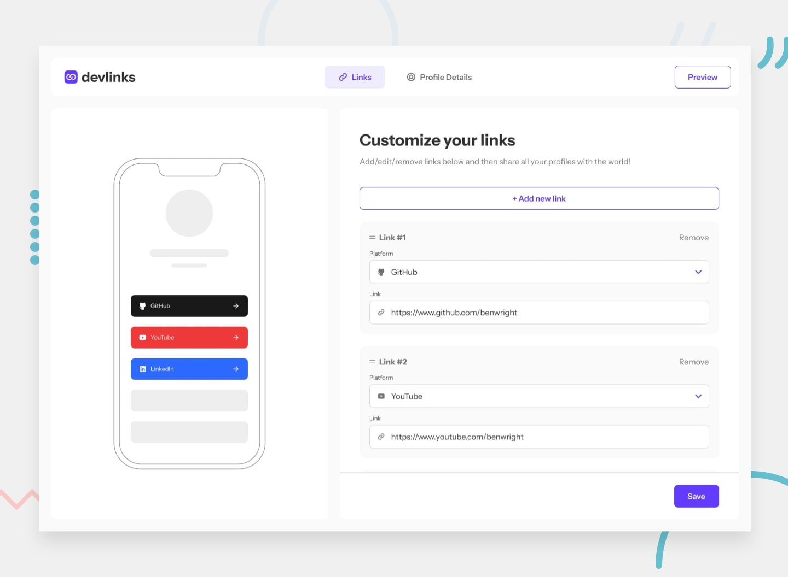

# Frontend Mentor - Link-sharing app

## Welcome! 👋

## The challenge

Your challenge is to build out this link-sharing app and get it looking as close to the design as possible.

You need to use React or another Javascript Framework/Library.
You need to use Node.js for the back end (ie. routes).
You need to save the data in a database.
You need to implement authentication.

Your users should be able to:

- Create, read, update, delete links and see previews in the mobile mockup
- Receive validations if the links form is submitted without a URL or with the wrong URL pattern for the platform
- Drag and drop links to reorder them
- Add profile details like profile picture, first name, last name, and email
- Receive validations if the profile details form is saved with no first or last name
- Preview their devlinks profile and copy the link to their clipboard
- View the optimal layout for the interface depending on their device's screen size
- See hover and focus states for all interactive elements on the page

### Expected behaviour

- Links
  - Clicking "Add new link" will add a new repeater where the user can select the platform to add a link for and add the URL.
  - Adding a new link should immediately show the platform's link inn the mobile mockup illustration even before the form is saved.
  - When the user clicks "Save", the form should validate for the presence of a URL and ensure the URL pattern is correct for the platform (e.g. "https://www.frontendmentor.io/profile/:username" for the Frontend Mentor link).
  - The user should be able to drag and drop by clicking and holding the two-line hamburger icon in the top left of each link repeater.
  - The mobile mockup illustration isn't shown on tablet and mobile layouts. The user would need to click through to the preview page to see their profile. Feel free to play around with this UX if you want to include the mobile mockup illustration for mobile and tablet.
- Profile Details
  - First name and last name are the only required fields. If no profile picture or email address are present, remove the necessary parts of the mobile mockup or use the person's initials inside the circle where the profile picture would be.
  - You can use Web APIs like FileReader to handle the image upload. You can do this completely client-side if you're just building the front-end. If you're building full-stack, this is a nice opportunity to integrate with a media hosting service like Cloudinary and practice using their API. Remember to keep your API credentials secret if you choose this route!
- Preview
  - Clicking "Share Link" should copy the current URL to the user's clipboard and show the relevant toast message shown in the design.
  - If you're building the project as a full-stack app, ensure only the current user can only see the header with the "Back to Editor" and "Share Link" call-to-actions if they are the same user as the one in the profile. If they're not, the header should disappear and they shouldn't be able to access the admin area.

## Where to find everything

Your task is to build out the project to the design file provided. We provide both Sketch and Figma versions of the design, so you can choose which tool you prefer to use. You can download the design file on the platform. **Please be sure not to share them with anyone else.** The design download comes with a `README.md` file as well to help you get set up.

All the required assets for this project are in the `/assets` folder. The images are already exported for the correct screen size and optimized. Some are reusable at multiple screen sizes. So if you don't see an image in a specific folder, it will typically be in another folder for that page.

We also include variable and static font files for the required fonts for this project. You can choose to either link to Google Fonts or use the local font files to host the fonts yourself. Note that we've removed the static font files for the font weights that aren't needed for this project.

The design system in the design file will give you more information about the various colors, fonts, and styles used in this project. Our fonts always come from [Google Fonts](https://fonts.google.com/).

## Building your project

Feel free to use any workflow that you feel comfortable with. Below is a suggested process, but do not feel like you need to follow these steps:

1. Separate the `starter-code` from the rest of this project and rename it to something meaningful for you. Initialize the codebase as a public repository on [GitHub](https://github.com/). Creating a repo will make it easier to share your code with the community if you need help. If you're not sure how to do this, [have a read-through of this Try Git resource](https://try.github.io/). **⚠️ IMPORTANT ⚠️: There are already a couple of `.gitignore` files in this project. Please do not remove them or change the content of the files. If you create a brand new project, please use the `.gitignore` files provided in your new codebase. This is to avoid the accidental upload of the design files to GitHub. With these premium challenges, please be sure not to share the design files in your GitHub repo. Thanks!**
2. Configure your repository to publish your code to a web address. This will also be useful if you need some help during a challenge as you can share the URL for your project with your repo URL. There are a number of ways to do this, and we provide some recommendations below.
3. Look through the designs to start planning out how you'll tackle the project. This step is crucial to help you think ahead for CSS classes to create reusable styles.
4. Before adding any styles, structure your content with HTML. Writing your HTML first can help focus your attention on creating well-structured content.
5. Write out the base styles for your project, including general content styles, such as `font-family` and `font-size`.
6. Start adding styles to the top of the page and work down. Only move on to the next section once you're happy you've completed the area you're working on.

## Deploying your project

As mentioned above, there are many ways to host your project for free. Our recommend hosts are:

- [GitHub Pages](https://pages.github.com/)
- [Vercel](https://vercel.com/)
- [Netlify](https://www.netlify.com/)

You can host your site using one of these solutions or any of our other trusted providers. [Read more about our recommended and trusted hosts](https://medium.com/frontend-mentor/frontend-mentor-trusted-hosting-providers-bf000dfebe).

## Create a custom `README.md`

We strongly recommend overwriting this `README.md` with a custom one. We've provided a template inside the [`README-template.md`](./README-template.md) file in this starter code.

The template provides a guide for what to add. A custom `README` will help you explain your project and reflect on your learnings. Please feel free to edit our template as much as you like.

Once you've added your information to the template, delete this file and rename the `README-template.md` file to `README.md`. That will make it show up as your repository's README file.

**Have fun building!** 🚀
